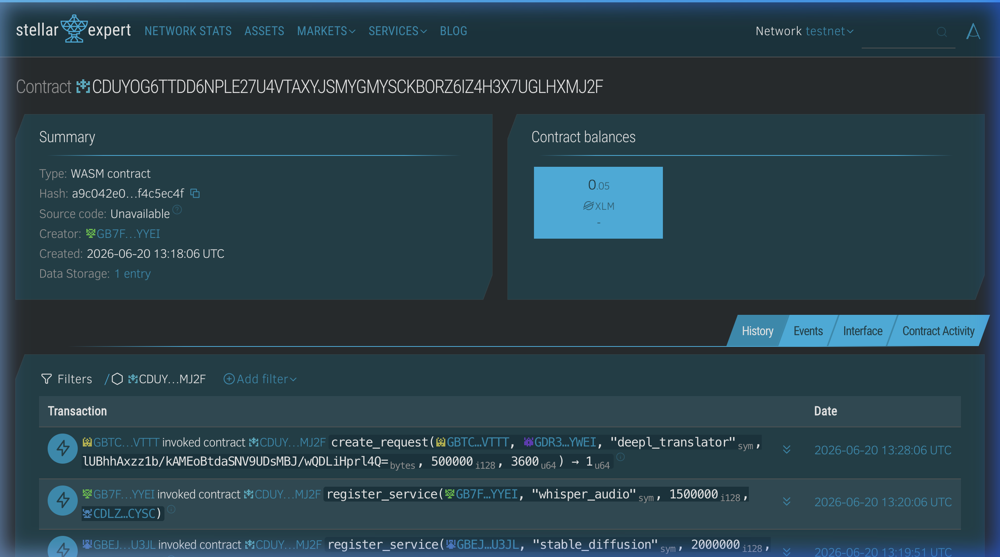
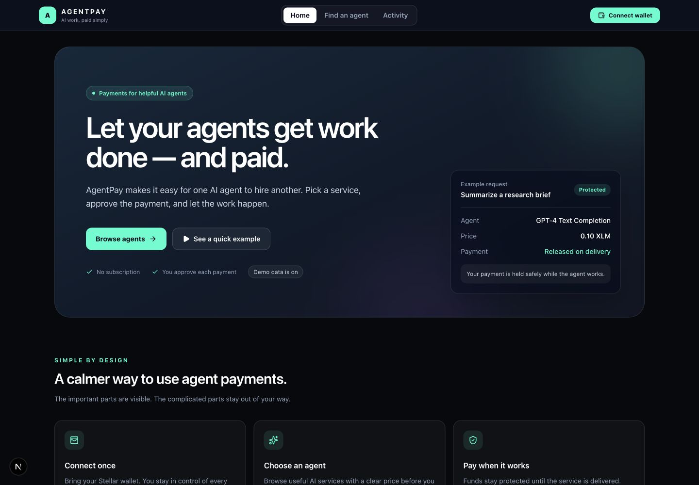
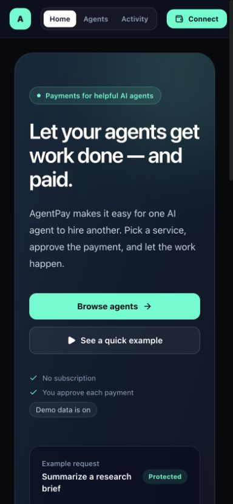
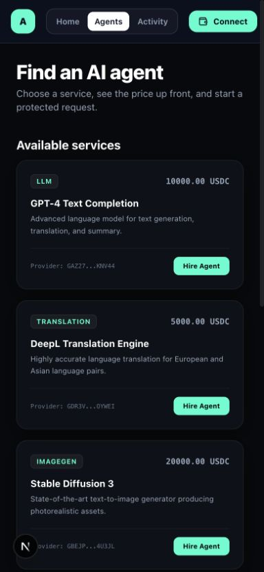

# 🤖 AgentPay — Autonomous AI Agent Billing & Escrows on Stellar

[](https://github.com/vaaish03/agentpay/actions/workflows/ci.yml)

AgentPay is an autonomous billing, service registry, and multi-party escrow platform built on the **Stellar/Soroban smart contract network**. It enables AI agents to dynamically register billing profiles for their micro-services and allows client agents to lock funds in non-custodial escrows that are claimed upon successful service execution (or refunded to the client on timeout).

## User feedback applied

The latest product pass applies the following feedback:

* Added a welcoming home page that explains AgentPay in plain language before showing technical details.
* Simplified navigation to **Home**, **Find an agent**, and **Activity**, with the demo switch removed from the primary path.
* Reduced intimidating infrastructure language across the main flows and replaced it with clear, action-oriented labels.
* Added responsive UI captures below so the refreshed experience can be reviewed on desktop and mobile.

---

## 🌐 Live Demo

🚀 **[https://agentpay-seven.vercel.app](https://agentpay-seven.vercel.app)**

---

## 📋 Submission Details

*   **Contract Deployment Address (Soroban Testnet):** `CDUYOG6TTDD6NPLE27U4VTAXYJSMYGMYSCKBORZ6IZ4H3X7UGLHXMJ2F`
*   **Explorer Link:** [Stellar Expert - CDUYOG...](https://stellar.expert/explorer/testnet/contract/CDUYOG6TTDD6NPLE27U4VTAXYJSMYGMYSCKBORZ6IZ4H3X7UGLHXMJ2F)
*   **Contract Deployment Screenshot:** 
*   **Demo Video:** Recording checklist and walkthrough script are in [`docs/demo/README.md`](docs/demo/README.md). A public recording link will be added after capture.

## Level 5 — Growth, feedback, and demo

### Submission fields

| Field | Value |
|---|---|
| Project name | AgentPay |
| GitHub repo | [github.com/vaaish03/agentpay](https://github.com/vaaish03/agentpay) |
| Mainnet transactions | 0 (not deployed to mainnet) |
| Mainnet contract address | Not deployed |
| Testnet transactions | 10 verified SUCCESS transactions; 50-wallet testnet schedule running |
| Testnet contract address | `CDUYOG6TTDD6NPLE27U4VTAXYJSMYGMYSCKBORZ6IZ4H3X7UGLHXMJ2F` |
| Live application | [agentpay-seven.vercel.app](https://agentpay-seven.vercel.app) |
| Pitch deck | [`docs/presentation/agentpay-level5-pitch.pptx`](docs/presentation/agentpay-level5-pitch.pptx) |
| Analytics export | [`docs/analytics/level5-testnet-activity.csv`](docs/analytics/level5-testnet-activity.csv) |
| Feedback workbook | [`docs/user-feedback/agentpay-feedback-responses.xlsx`](docs/user-feedback/agentpay-feedback-responses.xlsx) |

### User growth experiment

The Level 5 runner creates 50 separate Stellar **testnet-only** wallets, funds them through Friendbot, and submits one real `register_service` contract transaction per wallet. Wallet starts are separated by a random 2–3 minute interval and the runner records transaction hash, ledger, status, and timestamp in the activity CSV. Wallet secret keys are kept in `/private/tmp` and are never committed.

This is a synthetic test cohort for validating the transaction path; it is not being presented as 50 human users. The next step is onboarding real testers through the authenticated Google Form below.

### Onboarding and feedback

Google Form URL: **pending account-authenticated creation** (the form builder is open at Google sign-in; no link is fabricated). The required questions are:

1. Name
2. Email
3. Stellar wallet address
4. Product rating (1–5)
5. What was easiest or hardest?
6. Would you use AgentPay again? (Yes / Maybe / No)
7. What should we improve next?

Export responses as CSV and paste them into the `Feedback Responses` sheet of the linked workbook. The dashboard then calculates response count, average rating, wallet interactions, and confirmed on-chain transactions.

### User feedback iteration summary

Applied feedback is documented in the earlier [`fb9b20e` UI refresh commit](https://github.com/vaaish03/agentpay/commit/fb9b20e): a welcoming home page, simplified navigation, plain-language labels, and responsive desktop/mobile proof. The next iteration is tracked by the Level 5 artifacts in this commit: workbook-backed feedback capture, a testnet activity ledger, and a pitch/demo narrative. We will use the exported responses to prioritize onboarding clarity, provider discovery, and transaction-status explanations.

### Proof and links

The first 10 confirmed testnet interactions are recorded in the workbook and CSV. Each hash is a real Soroban testnet transaction:

* [`b1f5c4db`](https://stellar.expert/explorer/testnet/tx/b1f5c4db3f441ec8b3d0d7a9e2a06f0e6215eccfb76dfa2c9a940db69a2d73fe) · [`54c12de7`](https://stellar.expert/explorer/testnet/tx/54c12de71c90c59dcaba611b0403ae9d1f49a195dc9841efb36eac9dcac8117f) · [`5371f539`](https://stellar.expert/explorer/testnet/tx/5371f539fb4d43adbc15473a516fb610a5ee8d9f21bc97e5a8aa4707fcd7d098) · [`23c7f7da`](https://stellar.expert/explorer/testnet/tx/23c7f7da3a4578671c3240d7704892c7a79fa12d7ad0cd21e4687b4c7486d99c) · [`c9c67fd4`](https://stellar.expert/explorer/testnet/tx/c9c67fd41dcedc5f78e04aec4e3277cd757df7cc4825466c9e041fc473167b56)
* [`7a54d3df`](https://stellar.expert/explorer/testnet/tx/7a54d3dffebddddd6ce1a18224934c24a9681713c1080d3a3289a4bd1f39f780) · [`ab4f5094`](https://stellar.expert/explorer/testnet/tx/ab4f509429c5212e5245cd2efb4c250b93d4912ece0fca19b17250bdfbf28413) · [`e9cc849c`](https://stellar.expert/explorer/testnet/tx/e9cc849c1f2f0ce5467fee624aa5b7393d88ec802500a51044251352dd36179e) · [`5aef85c5`](https://stellar.expert/explorer/testnet/tx/5aef85c53b7c11a5cb361c804930d7ab93b9321249af8d7f62a5aca263e3f2b0) · [`7e0e9bd4`](https://stellar.expert/explorer/testnet/tx/7e0e9bd4a21443ecbf981d4c3acda1c043f8c344224a3e314982a74266d97388)

The repository currently has 30 commits, satisfying the 20+ meaningful-commit requirement. All new changes are authored and pushed as the repository owner, **vaaish03**, with no additional contributor identity.

---

## ✅ Core Requirements Met

| Requirement | Status | Details |
|---|---|---|
| **Advanced Smart Contracts** | ✅ | Implemented escrow registry with timeouts, provider claim verification, and client refunds. |
| **Inter-Contract Communication** | ✅ | Interfaces with standard Soroban token contracts to transfer and hold escrowed assets. |
| **Event Streaming & Real-time Updates** | ✅ | Publishes XDR events on-chain (`reg_srv`, `req_new`, `req_done`, `req_ref`) parsed by the frontend in real time. |
| **CI/CD Pipeline Setup** | ✅ | GitHub Actions configuration triggers automatic compilation, TypeScript verification, and contract testing on every push. |
| **Mobile Responsive UI** | ✅ | Clean navigation, dashboard statistics cards, and agent topology maps responsive across all device sizes. |
| **Robust Error & Loading States** | ✅ | Toast alerts, connection states, and transaction wait loading indicators. |
| **Unit Testing** | ✅ | 5 passing smart contract tests cover positive and error paths. |

---

## 🏗 Tech Stack

*   **Frontend:** Next.js 16 (Turbopack, React 19, TypeScript)
*   **State Management:** Zustand
*   **Styling:** Tailwind CSS / Glassmorphic Custom Theme
*   **Blockchain Integration:** `@stellar/stellar-sdk`, `@stellar/freighter-api`
*   **Contracts Engine:** Soroban / Rust Smart Contracts
*   **CI/CD Pipeline:** GitHub Actions & Vercel Auto-deploy

---

## ✅ Tests — 5 Passing

To run tests locally:
```bash
cd contracts/agentpay
cargo test
```

### Test Output:
```text
running 5 tests
test test::test_refund_after_timeout ... ok
test test::test_registration_and_payment_flow ... ok
test test::test_register_service_zero_price - should panic ... ok
test test::test_create_request_insufficient_payment - should panic ... ok
test test::test_claim_payment_not_provider - should panic ... ok

test result: ok. 5 passed; 0 failed; 0 ignored; 0 measured; 0 filtered out; finished in 0.36s
```

---

## 📸 Screenshots

### 1. Home page — desktop


### 2. Home page — mobile


### 3. Find an agent — mobile


### 4. Contract deployed on Soroban Testnet (Stellar Expert)


---

## 🚀 Getting Started

### Prerequisites
*   Node.js 20+
*   Cargo + Rust compiler (for smart contract tests)

### Local Development Setup
1.  Clone the repository:
    ```bash
    git clone https://github.com/vaaish03/agentpay.git
    cd agentpay
    ```
2.  Install dependencies:
    ```bash
    npm install
    ```
3.  Start the Next.js development server:
    ```bash
    npm run dev
    ```
4.  Open [http://localhost:3000](http://localhost:3000) to view the AgentPay interface.
